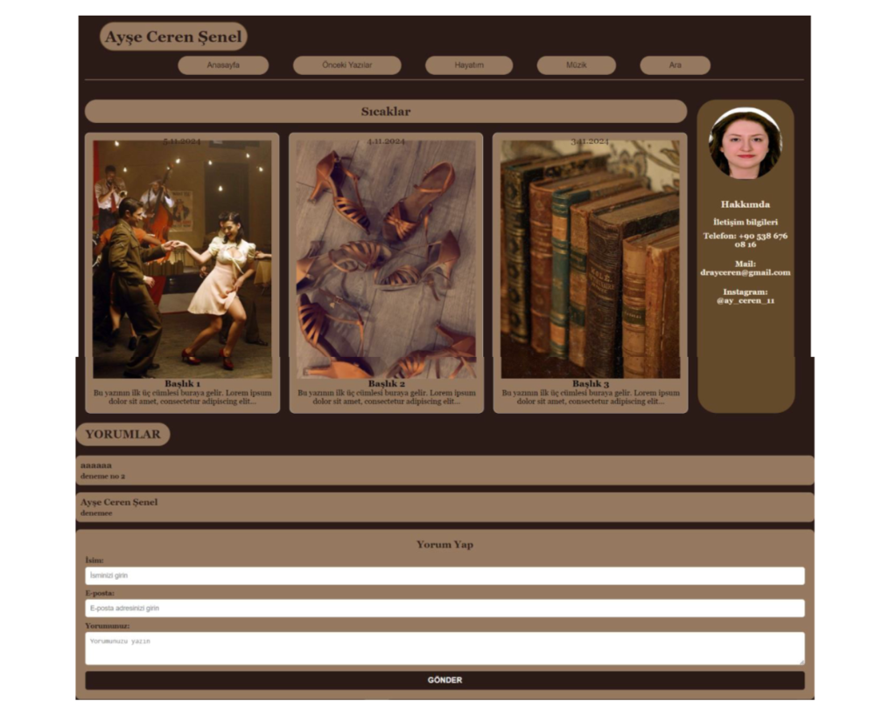
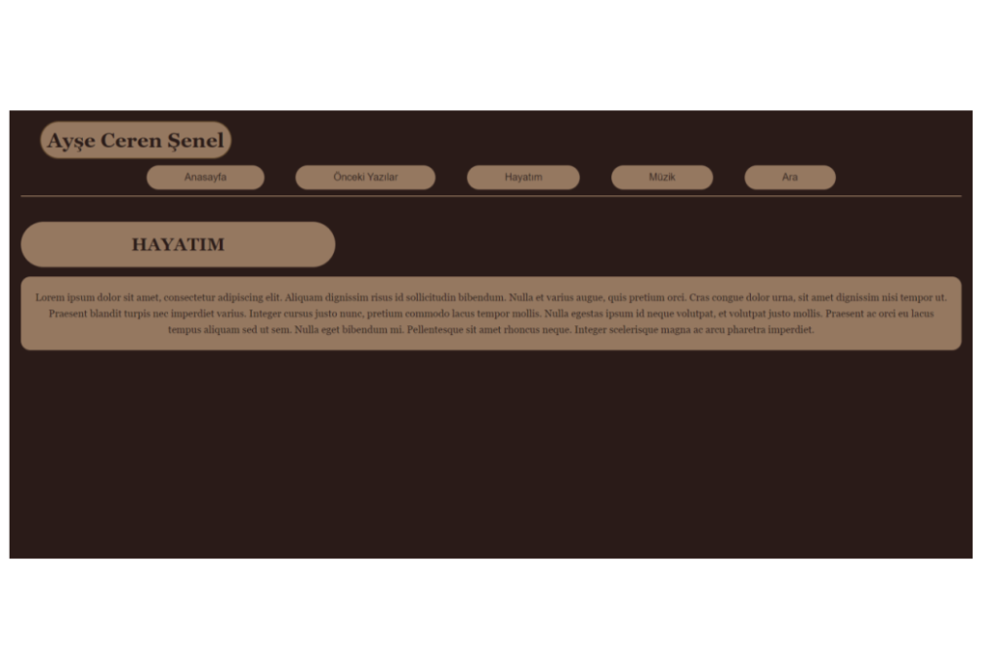
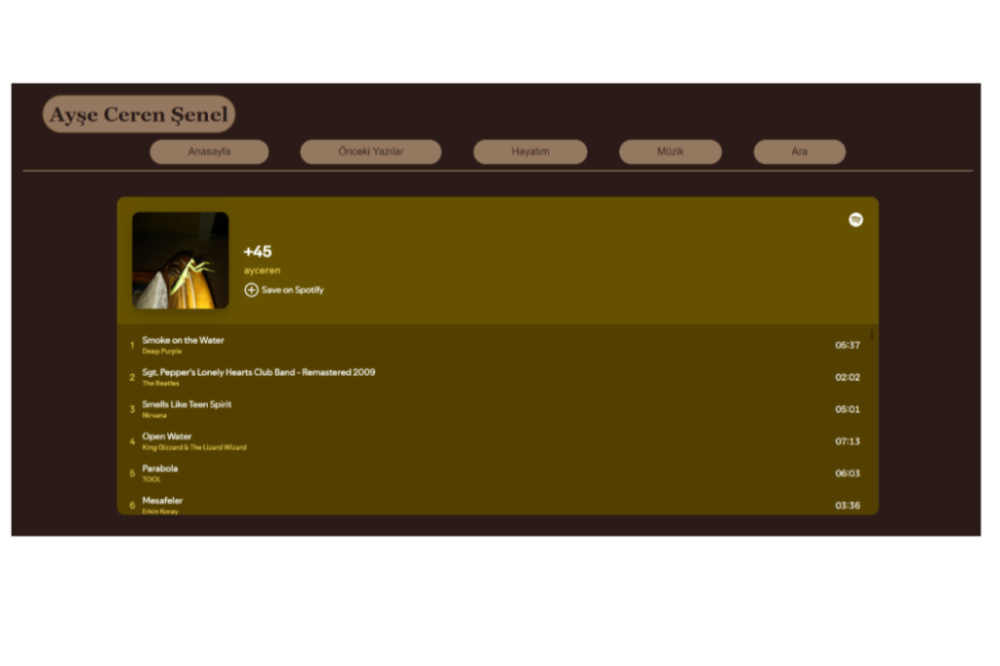
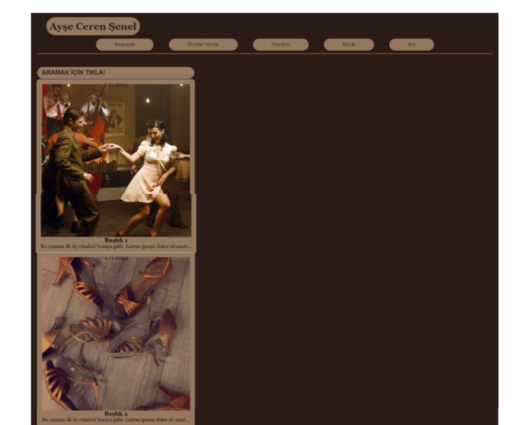
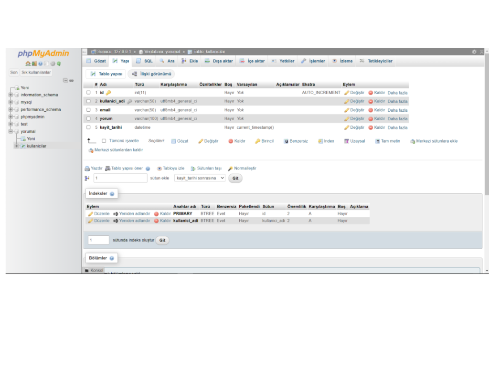

# Ayşe Ceren Şenel - Personal Blog & Portfolio

A modern, PHP-powered personal blog and portfolio website designed to showcase personal experiences, blog posts, and interactive features like a custom comment system and music integration.

## 📺 Project Video
You can watch the project demonstration video here:
[https://youtu.be/0KIeq1xtqEc?si=afAHiNSNqTckNYtM]

---

## 🚀 Features

- **Dynamic Comment System**: A full-stack implementation using PHP and MySQL that allows users to leave comments with their name and email.
- **Music Integration**: A dedicated music section featuring an embedded Spotify playlist to share curated tracks.
- **Search Functionality**: An interactive search page to help users find specific blog content.
- **Responsive Design**: A clean and earthy-toned UI that adapts to different sections like "My Life", "Previous Posts", and individual blog entries.
- **Database Management**: Backend powered by MySQL to store and retrieve user interactions securely.

---

## 🛠️ Tech Stack

- **Frontend**: HTML5, CSS3 (Custom styling with a unique brown/warm palette)
- **Backend**: PHP (7.4+)
- **Database**: MySQL (using mysqli)
- **Integrations**: Spotify Web API (Iframe Embed)

---

## 📸 User Interface (UI)

Below are the screenshots of the application showing its various sections and backend structure.

### 1. Home Page & Comment Section
The home page features the "Sıcaklar" (Latest Posts) section and a sidebar with "About Me" information. At the bottom, visitors can view existing comments and submit their own.



### 2. "My Life" (Hayatım) Section
A dedicated space for personal stories and experiences, styled with consistent typography and layout.



### 3. Music (Müzik) Section
An integrated Spotify playlist that adds a personal touch to the website experience.



### 4. Search (Ara) Page
The search interface allows users to navigate through the blog's content efficiently.



### 5. Database Structure (phpMyAdmin)
The backend database `yorum` contains the `kullanicilar` table, which stores the name, email, comment, and registration date for each user interaction.



---

## 📁 Project Structure

```text
personal-website/
├── uyelik/
│   ├── index.php          # Main landing page & comment logic
│   ├── baglanti.php       # Database connection settings
│   ├── hayatım.html       # "My Life" page
│   ├── müzik.html         # Music/Spotify integration page
│   ├── ara.html           # Search interface
│   ├── styles.css         # Core layout styling
│   ├── yazı1-5.html       # Individual blog post pages
│   └── ben.jpeg           # Profile picture
├── screenshots/           # UI Screenshot images
└── README.md              # Project documentation
```

---

## ⚙️ Installation & Setup

1. **Database Setup**:
   - Create a database named `yorum` in your MySQL server.
   - Run the following SQL query to create the comments table:
     ```sql
     CREATE TABLE kullanicilar (
         id INT(11) AUTO_INCREMENT PRIMARY KEY,
         kullanici_adi VARCHAR(50) NOT NULL,
         email VARCHAR(50) NOT NULL,
         yorum VARCHAR(100) NOT NULL,
         kayit_tarihi DATETIME DEFAULT CURRENT_TIMESTAMP
     );
     ```

2. **Configuration**:
   - Update `uyelik/baglanti.php` with your database credentials (host, username, password).

3. **Running the Project**:
   - Place the project folder in your local server directory (e.g., `htdocs` for XAMPP).
   - Navigate to `http://localhost/personal-website/uyelik/index.php`.

---

© 2024 Ayşe Ceren Şenel
